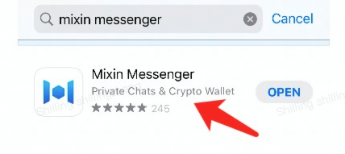

# For Business

### Merchant Tools

MixPay offers a variety of ways to accept crypto payments from your customers. Get started setting up your MixPay account and accepting crypto payments by following along in our Step-by-Step Integration Guide.

#### **Ecommerce Integration Guide**

To help you out, we have created a simple and free step-by-step guide to help getting your business all set up to start accepting cryptocurrency payments using the MixPay payment gateway, which lets you receive any cryptocurrencies as payment at your store.

**Account Setup**

**1. Sign up**

Creat your [Mixin Messenger](https://mixin.one/messenger) account。

**2. Add MixPay bot**

Search bot ID (7000104220) in Mixin, add bot. Get started by following the steps below to add MixPay.

**3. Receive Settings**

Here, you can modify which coins/fiats you want to accept as payment.

Go to: **"MixPay bot-Receive-Receive Settings,"** select which coins/fiats you want to accept as payment by setting up receiving currency.

**eCommerce Integration**

Accept multiple cryptocurrencies in your store with MixPay. Follow these simple steps:

1. Sign in MixPay.
2. Pre-Built eCommerce Plugins. There’s a full list of the pre-built plugins and integrations for all the major eCommerce platforms.

